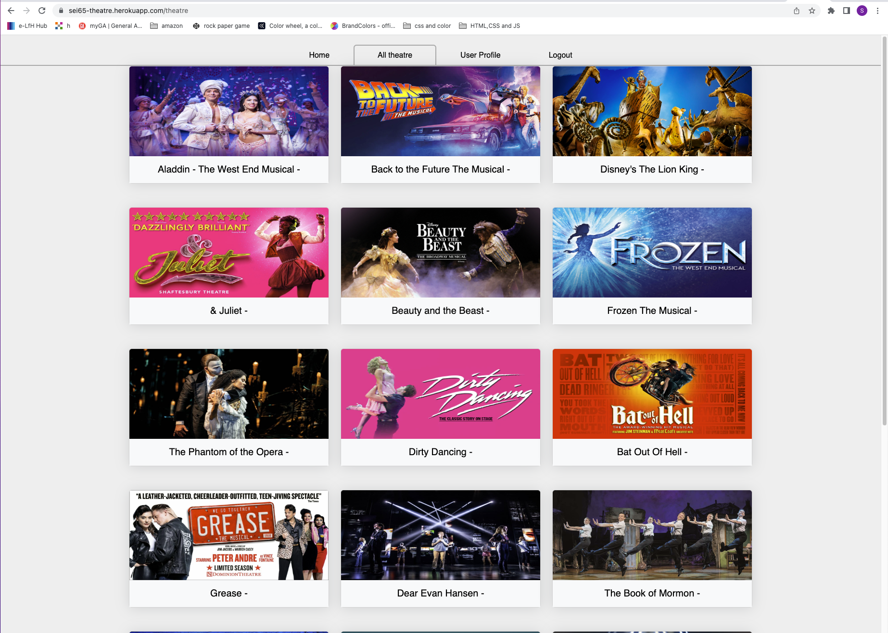
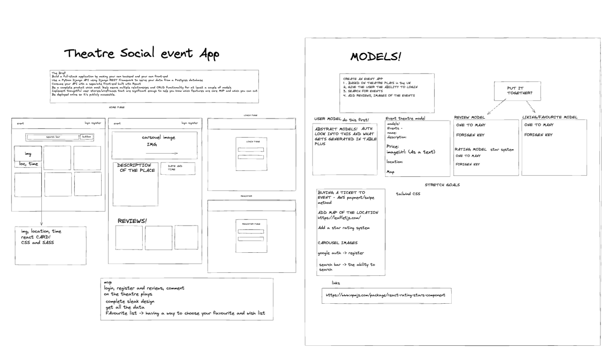
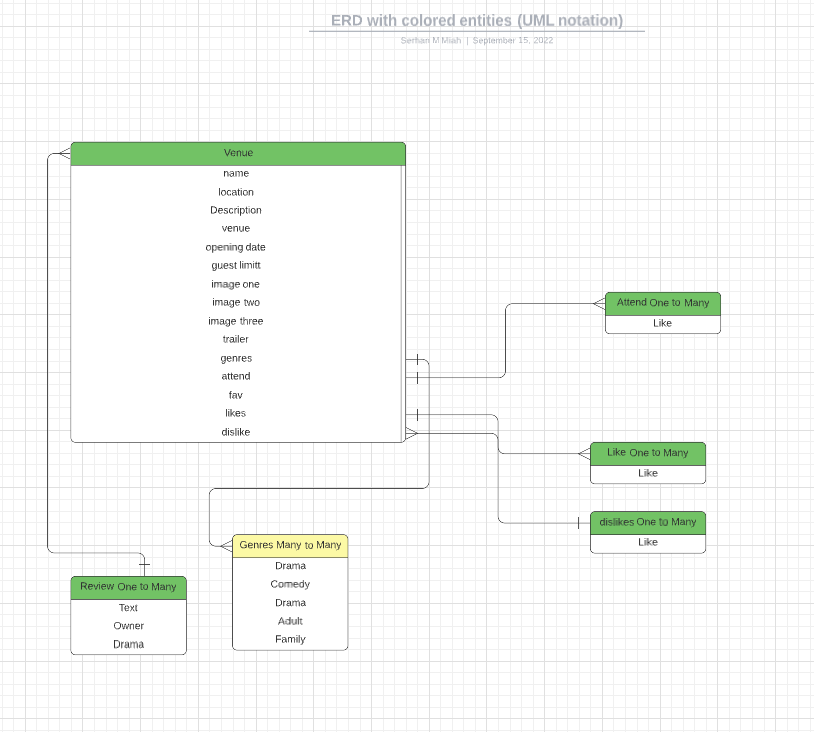
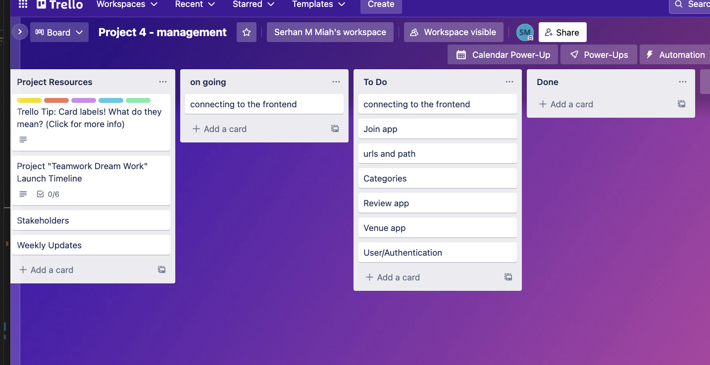
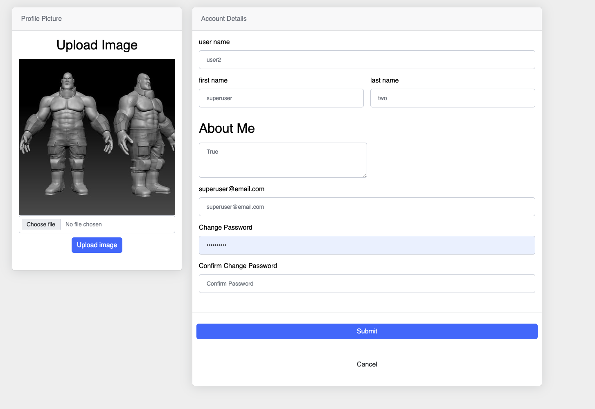
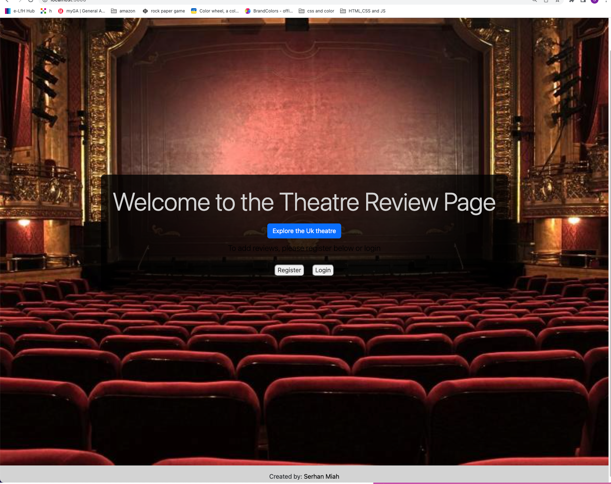

# Project 4 - Theatre Social App

## Project Overview

A 7-day solo project where I used Django, Rest Framework, Python, CLI, AJAX, JavaScript, NodeJS, React, Insomnia, Cloudinary and AWS S3 to make an API with Django Toolkit with Rest Framework that connects to the frontend with React, that has CRUD functionality and would link OneToMany and ManytoMany relationship between the User and the multiple Apps inside the API. 


## Deployment

You will find the completed project here: https://sei65-theatre.herokuapp.com/theatre

To see the full features for Theatre, please feel free to log in using the following credentials:
email: user@email.com
password: Password@


## Code Installation:

Clone or download the repo then in your Terminal run the following commands:

* Install back-end dependencies: pipenv install
* Enter Shell for project: pipenv shell
* Make Migrations: python manage.py makemigrations
* Migrate: python manage.py migrate
* Load Seed data for Job Statuses: python manage.py loaddata job_status/seeds.json
* Load Seed data for Task Categories: python manage.py loaddata task_categories/seeds.json
* Start back-end server: python manage.py runserver


## The Brief

* Build a full-stack application by making your backend and your frontend
* Use a Python Django API using Django REST Framework to serve your data from a Postgres database
* Consume your API with a separate front end built with React
* Be a complete product which most likely means multiple relationships and CRUD functionality for at least a  couple of models
* Implement thoughtful user stories/wireframes that are significant enough to help you know which features are core MVP and which you can cut
* Be deployed online so it's publicly accessible.




## Technologies used:

### Front end:
* React
* SCSS
* Axios
* Nodemon
* React Router Dom
* React Responsive Carousel

### Back end:
* Python
* Django
* Django REST Framework
* Psycopg2
* pyJWT

### Dev Tools:
* VS code
* Yarn
* Insomnia
* Git
* Github
* Google Chrome dev tools
* Heroku (deployment)
* Trello Board (planning and timeline)
* Excalidraw (wireframing)
* Zoom
* Slack


## Phase

This project consisted of four phase

### Phase 1 - (Planning):

Once I determined the nature of the app, I planned the relationships with Escalidraw and LucidChart. Then I built the API with Django using Apps, Views, and URLs. I still need to test each endpoint on Insomnia to ensure the API will function.

Wireframe: 



ERD - Relationship Planning:


By using LucidChart, simply another tool for planning like Excalidraw but specifically for detailing Entity Relationships. The above is showing how I would link OneToMany and ManytoMany relationship between the user, venue, category, review and join apps and models. 	
Throughout my planning, I used Git and GitHub for version control and decided that since I am working on this solo it would be good practice to work on branches and add, commit and push changes regularly. During the project, I created a Trello with a completed task list. To ensure that I focus on one task at a time and to make sure that I complete the work. By creating a to-do list I was able to keep on top of the project.

Trello Board: 



### Phase 2: Creating the backend with Django and Rest Framework:

This was my first time creating a backend using Python, Django, and REST. I started by installing all necessary packages (including JWT and REST, among others) to link to a PostgreSQL database. I changed the setting once it was linked to TablePlus so that all changes would show on the PostgreSQL database.

I made five apps. I first created the Users/Authorisation model by using the default AbstractUser inside Django. I was able to use all the relative fields inside of AbstractUser. I then created the main app which was a venue to hold all the theatre inside. 

I made five apps and models. One was a User/ Authorisation model (Django - Abstract User). In a single user experience, I wanted tasks unique to registered users and a limited version for non-registered users, such as adding favourite shows and writing reviews. I tested the models with Insomnia on the second day. 

By the end of phase 2, I seeded my data. I gathered the information needed for the database (images, cast, description, etc) and stored them on GoogleDrive. All endpoints were working, so I loaded it up and began installing react for the front end.


```Javascript
    // Axios request of the theatre and mapping it 
const Theatre = () => {
  const [ venueData, setVenueData ] = useState([])
  const [ errors, setErrors ] = useState(false)

  useEffect(() => {
    const getData = async () => {
      try {
        const { data } = await axios.get('/api/venue/')
    
        setVenueData(data)
      } catch (error) {
        setErrors(error)
      }
    } 
    getData()
  }, [])

  return (
    <Container className='main'>
      <div>
        { venueData 
          ?
          <div className='all-theatre-page'>
    
            <Container as="main-page" className='destination-index'>
              <Row className='destination-row'>
                { venueData.map(item => {
                  const { id } = item
                  return (
                    <Col key={id} md="5" lg="4" className='mb-4'>
                      <Link style={{ textDecoration: 'none', color: 'black' }} to={`/theatre/${id}`}>
                        <Card >
                          <Card.Img className='card-images' variant='top' src={item.image_one}></Card.Img>
                          <Card.Body className='bg-light'>
                            <Card.Title className='multi-card text-center mb-0 text-decoration-none'>{item.name} - {item.country}</Card.Title>
                          </Card.Body>
                        </Card>
                      </Link>
                    </Col>
                  )
                })
                }
              </Row>
            </Container>
          </div>
          :
          
          <h2 className='text-center'>
            { errors ? 'Something went wrong. Please try again later' : <Spinner />}
          </h2> 
        }
      </div>
    </Container>
  )

}

export default Theatre
```


### Phase 3 Connecting to React with CRUD Functionality

I started by downloading the frontend using the CLI inside the back end folder. I installed all relevant packages for React. In the third phase, I would use many packages, for example Axios, to get the data from the API and BootStrap to make the website. I would use JSX, a combination of Vanilla JS, Semantic HTML and conditional JS, to display the relevant data stored in the API.
 
Once the API was paired using Axios, I started working on how to have the user log in and log out off the front end. This was done by using a combination of Axios, and Hooks and by storing the JWT token inside the local storage. I would be able to set the JWT Token and return the decoded Token to confirm the user by using the package Buffer with the secret key that was inside the backend.

Login
```Javascript
    // POST HTTP request for login using Axios.
  const onSubmit = async (event) => {
    event.preventDefault()
    try {
      const { data } = await axios.post('api/auth/login/', loginData)
      console.log(data)
      setToken(data.token)
      setId(data.userId)
      navigate('/theatre')
    } catch (error) {
      setErrors(error.message)
      console.log(error.message)
    }
  }
```


Register section - code snippet front end and backend 
```Javascript
    // POST HTTP request for Register using Axios.
  const handleSubmit = async (event) => {
    event.preventDefault()
    try {
      const { data } = await axios.post('api/auth/register/', formData)
      console.log(data)
      navigate('/login')

    } catch (error) {
      setErrors( { ...errors, [event.target.name]: '', message: '' })
      console.log(error.mesage)
    }
  }

```

Front end React Form
```Javascript
    // React Form for Register with submit
  <h1>Register</h1>    
          
          <Form onSubmit={handleSubmit}>
            <Form.Group className="mb-3" >
              <Form.Label>First Name</Form.Label>
              <Form.Control  onChange={handleChange} type="text" name="first_name" placeholder='Enter your name' value={formData.first_name}  />
              <Form.Text className="text-muted">
                  Wll never share your email with anyone else.
              </Form.Text>
            </Form.Group>

            <Form.Group className="mb-3" >
              <Form.Label>Last Name</Form.Label>
              <Form.Control  onChange={handleChange} type="text" name="last_name" placeholder='Enter your name' value={formData.last_name}  />
              <Form.Text className="text-muted">
                  Wll never share your email with anyone else.
              </Form.Text>
            </Form.Group>

            <Form.Group className="mb-3" >
              <Form.Label>User Name</Form.Label>
              <Form.Control onChange={handleChange} type="text" name="username" placeholder="username" value={formData.userName} /> 
            </Form.Group>

            <Form.Group className="mb-3" >
              <Form.Label>Email address</Form.Label>
              <Form.Control  onChange={handleChange} type="email" name="email" placeholder='Email' value={formData.email}  />
              <Form.Text className="text-muted">
                  Wll never share your email with anyone else.
              </Form.Text>
            </Form.Group>

            <Form.Group className="mb-3" >
              <Form.Label>Password</Form.Label>
              <Form.Control onChange={handleChange} type="password" name="password" placeholder='Password' value={formData.password}  />
            </Form.Group>

            <Form.Group className="mb-3" >
              <Form.Label>Confirm Password</Form.Label>
              <Form.Control onChange={handleChange} type="password" name="password_confirmation" placeholder='Confirm Password' value={formData.password_confirmation} /> 
            </Form.Group>

            { errors && <p className='text-danger'>{errors}</p>}

            <Button variant="primary" type="submit">
              Submit
            </Button>
          </Form>

        </Row>

```


Back end API View for register

```Python
class RegisterView(APIView):
    def post(self, request):
        user_to_create = UserSerializer(data=request.data)
        try:
            user_to_create.is_valid(True) 
            user_to_create.save() 
            return Response(user_to_create.data, status=status.HTTP_202_ACCEPTED)
        except Exception as e:
            print(e)
            return Response(e.__dict__ if e.__dict__ else str(e), status=status.HTTP_422_UNPROCESSABLE_ENTITY)

```
Front end auth helper file for decoding Token

```JavaScript
// JWT Token, Set, get, split and decrypt with Bugger
import { Buffer } from 'buffer'

export const setToken = (token) => {
  window.localStorage.setItem('local-user-Token', token)
}
export const setId = (id) => {
  window.localStorage.setItem('local-user-Id', id)
}

export const getToken = () => {
  return window.localStorage.getItem('local-user-Token')
}

export const getId = () => {
  return window.localStorage.getItem('local-user-Id')
}

export const getPayLoad = () => {
  const token = getToken()
  console.log(token)
  if (!token) return 
  const splitToken = token.split('.')
  if (splitToken.length !== 3) return 
  return JSON.parse(Buffer.from(splitToken[1], 'base64'))
}

export const userIsAuthenticated = () => {
  const payload = getPayLoad()
  if (!payload) return 
  const currentTime = Math.round(Date.now() / 1000) 
  return currentTime < payload.exp
}

export const userIsOwner = (item) => {
  const payload = getPayLoad()
  if (!payload) return
  return payload.userId === item.createdBy //to string was at the ebd 
}
```


Front end helper code

At this point the login, logout and registration are now completed. The next checklist was to focus on the CRUD part of the project using Django and the REST Framework. I wanted the user to be able to leave a review/comment on the individual theatre page. I went back to Trello to keep my plan simple and write a checklist on what needed to be completed and how to get it completed. I used the application Insomnia to check for HTTP requests that were working by using the different methods inside the relative views inside the API. I went back and forth between the front end and insomnia testing on how to make a PUT request - this was a crucial part of the project; I wanted the user to be able to edit their comments.
 
I was able to authenticate who the unique owner is, by their own unique JWT token stored in the local storage. I was able to confirm if the user was valid and authenticated by creating a function called userIsAuthenticated that will check the payload and by using a package called Buffer to check if the user is valid. If they are valid the user would be able to add a review to the page. 

user is authenticated code snippet
```Javascript
    // User is Authenticated conditional will display if valid.
   { userIsAuthenticated()  ? 
                <Link to={`/add-review/${playId}`}>
                  {/* <button className='back-button btn btn-primary'>Add a review</button> */}
                </Link>
                :
                <Link to={'/'}>
                  <button className='btn btn-primary'>Login to add a review</button>
                </Link>
              }     
```


Inside the function, I created a link element and a button so the user can edit their review. A button will appear only if the user is valid, giving a link to a path so that the user can edit their review. I began first by allowing the user to be authenticated with Rest framework permission in the backend and requesting that the owner is equal to the request of the user id. Once this was done, I tested in insomnia to check if the PUT request was working then moved to the front end.

Below is a screenshot of how to edit the review based on the user. 


```Python
    # // Review APIView detailed, with permission class
  class ReviewDetailView(APIView):
    permission_classes = (IsAuthenticatedOrReadOnly, )

    def get_review(self, pk):
        try:
            return Review.objects.get(pk=pk)
        except Review.DoesNotExist:
            raise NotFound("Review not found!")

    def delete(self, request, pk):
        review_to_delete = self.get_review(pk=pk)

        if review_to_delete.owner != request.user:
            raise PermissionDenied("Unauthorised")

        review_to_delete.delete()
        print('errors -----> ', review_to_delete.errors)
        return Response(status=status.HTTP_204_NO_CONTENT)

```

To overcome this I set two useState. One to hold the parseInt of the theatre and the other to hold the text as an empty string. I changed the path and view inside the review app located in the back end and tested the method was working using insomnia. I had to change the permission and the request of the owner to be equal to the requested user Id. A code snippet is shown below.

```Python
    # // PUT method to edit review based on the owner.
    def put(self, request, pk ):
        edit_review = self.get_review(pk)
        request.data['owner'] = request.user.id
        edit_serializer = ReviewSerializer(edit_review, data=request.data)
        if edit_serializer.is_valid():
            edit_serializer.save()
            return Response(edit_serializer.data)
        print('errors -----> ', edit_serializer.errors)
        return Response(edit_serializer.errors, status=status.HTTP_400_BAD_REQUEST)  
```

With this, I could now edit the comment with the review Id and the theatre ID as both needed to be selected. When making the path in Axios I need the path to be both the playId and the reviewId so that both the front end and back end know which theatre is selected and which review Id is selected.

```JavaScript
  // handle submit review, auth with bearer's token
  const handleSubmitReview = async (event) => {
    event.preventDefault()
    try {
      const { data } = await axios.put(`/api/review/${reviewId}/`, formData, {
        headers: {
          Authorization: `Bearer ${getToken()}`,
        },
      })

      console.log('data ------>', data)
      setFormData({ text: '', theatre: '', owner: '' })
      setTheatre(data)
      console.log(setReviews)
      // window.location.reload()
      navigate(`/theatre/${playId}`)
    } catch (error) {
      console.log(error)
      // setErrors(error)
    }
  }

```


By using an onSubmit and a handle change inside the Form, I was able to update the user review.  The handle submits will target the API review id, by the user authorisation from their unique JWT token. The handle change will use another useState to change the name to be equal to the value which is shown below.


code goes here
```JavaScript
  // handle Change review, name to be equal to value
  const handleChange = async (event) => {
    setFormData({ ...formData, [event.target.name]: event.target.value })
    setErrors({ ...errors, [event.target.name]: '', message: '' })
  }

```

```JavaScript
  // JSX with onSubmit and handle Change review
    return (
    <main className="add-review-page justify-content-center">
      <Form className="review-form" onSubmit={handleSubmitReview}>
        <h1>Edit Review</h1>

        <Form.Group>
          <Form.Label htmlFor="reviewText" >Review Text</Form.Label>          
          <Form.Control as="textarea" rows={4} name='text' value={updatedReview.text} placeholder="Type Review Here"  onChange={handleChange} />
        </Form.Group>

        <Button variant="primary" type="submit">
          Submit
        </Button>        
        {/* { errors && <p className='text-danger'>{errors}</p>} */}
      </Form>
    </main>
  )

```

The last phase for part three involved getting the user to edit their profile page. I needed to go back to the API and insert a few more models under the user, which will hold a first name, last name and bio. I passed through the selected models as blank to equal true, as shown below so that when the user registers they will not need to input this information and can be adjusted in the edit user profile section.

```Python
    # // Python class User with AbstractUser.
class User(AbstractUser):
    email = models.CharField(max_length=100, unique=True)
    profile_image = models.CharField(max_length=500, blank=True)
    bio = models.TextField(max_length=500, default=True, blank=True)
    first_name = models.CharField(max_length=100, blank=True)
    last_name = models.CharField(max_length=100, blank=True)
```

```JavaScript
  // JSX with onSubmit and handle Change review
   <Container className='Edit-profile-hero'>

      { userProfile.email ? 
        <>
          <Form onSubmit={handleSubmit}>
            <div className="row">
              <div className="col-xl-4">
                <div className="card mb-4 mb-xl-0">
                  <div className="card-header">Profile Picture</div>
                  <div className="card-body text-center">
                    <Form.Group className="mb-3" >
                      { newProfileImg ? 
                        
                        :
                        <></>
                      }
                      <Form.Label><h2>Upload Image</h2></Form.Label>
                      <Col>
                        
                      </Col>
        
                      <Form.Control type="file" id="image" className="input" onChange={(event) => {
                        setImageSelected(event.target.files[0])
                      }} />
                      <Button onClick={uploadImage}>Upload image</Button>
                    </Form.Group>
                  </div>
                </div>
              </div>
              <div className="col-xl-8">
                <div className="card mb-4">
                  <div className="card-header">Account Details</div>
                  <div className="card-body">
                    
                    <div className="mb-3">
                      <Form.Group className="mb-3" >
                        <Form.Label>user name</Form.Label>
                        <Form.Control type="text" name="username" placeholder="Edit display name" value={updatedUserProfile.username} onChange={handleChange} /> 
                      </Form.Group>
                      {/* <label className="small mb-1" htmlFor="inputUsername">Username (how your name will appear to other users on the site)</label>
                      <input className="form-control" id="inputUsername" type="text" placeholder="Enter your username" value="username"/> */}
                    </div>

                    <div className="row gx-3 mb-3">
                      <div className="col-md-6">
                        <Form.Group className="mb-3" >
                          <Form.Label>first name</Form.Label>
                          <Form.Control type="text" name="email" placeholder="Edit email" value={updatedUserProfile.first_name} onChange={handleChange} /> 
                        </Form.Group>
                      </div>
                      <div className="col-md-6">
                        <Form.Group className="mb-3" >
                          <Form.Label>last name</Form.Label>
                          <Form.Control type="text" name="email" placeholder="Edit email" value={updatedUserProfile.last_name} onChange={handleChange} /> 
                        </Form.Group>
                        {/* <label className="small mb-1" htmlFor="inputLastName">Last name</label>
                        <input className="form-control" id="inputLastName" type="text" placeholder="Enter your last name" value="Luna"/> */}
                      </div>
                    </div>

                    <div className="col-md-6">
                      <Form.Group className="mb-3 w-full" >
                        <Form.Label><h2>About Me</h2></Form.Label>
                        <Form.Control as="textarea" rows={4} name="bio" placeholder="Edit About Me" value={updatedUserProfile.bio} onChange={handleChange} />        
                      </Form.Group>
                    </div>


                    <div className="mb-3">
                      <Form.Group className="mb-3" >
                        <Form.Label>{userProfile.email}</Form.Label>
                        <Form.Control type="text" name="email" placeholder="Edit email" value={updatedUserProfile.email} onChange={handleChange} /> 
                      </Form.Group>
                    </div>

                    <div className="mb-3">
                      <Form.Group className="mb-3" >
                        <Form.Label>Change Password</Form.Label>
                        <Form.Control onChange={handleChange} type="password" name="password" placeholder='Password' value={updatedUserProfile.password}  />
                      </Form.Group>
                    </div>
                    
                    <div className="mb-3">
                      <Form.Group className="mb-3" >
                        <Form.Label>Confirm Change Password</Form.Label>
                        <Form.Control onChange={handleChange} type="password" name="password_confirmation" placeholder='Confirm Password' value={updatedUserProfile.password_confirmation} /> 
                      </Form.Group>
                    </div>
                     


                  </div>
                  <hr />
                  <Button variant="primary" type="submit">Submit</Button>
                  <hr />
                  <Link to={`/users/${userId}`} className='btn dark'>Cancel</Link>
                  <hr />
                  {/* <button className="btn btn-primary" type="button">Save changes</button> */}
                   
                </div>
              </div>
          
            </div>
          </Form>
    
        </>
        :
        <h2 className="text-center">
          { errors ? 'Something went wrong. Please try again later' : 'spinner' }
        </h2>
      }  
      
    </Container>

```
The last part is to get the profile image working, with the user having the ability to upload their profile picture. I used Cloudinary for this part, which enables users to upload, store, manage, manipulate, and deliver images and videos for websites and apps. I made an async function to upload an image on my cloudinary account. Using a useState to replace the default profile image stored with a new image by using a useState that was uploaded to the Cloudinary by the URL.


```JavaScript
  // Function to upload image using cloudinary 
  const uploadImage = async (event) => {
    event.preventDefault()
    const formData = new FormData()
    formData.append('file', imageSelect)
    formData.append('upload_preset', 'djssiss0') 
    const { data } = await axios.post('https://api.cloudinary.com/v1_1/danedskby/image/upload', formData)
    console.log(data)
    setNewProfileImg(data.url)
    setUpdatedUserProfile({ ...updatedUserProfile, profile_image: data.url })
  }
```

Update the profile Result below





### Phase 4 Styling the Frontend

The last few days were spent styling and adding my creative style to the website. I did spend this time refactoring the code to incorporate React by making it workable on mobile devices. I added React Responsive Carousel, which is a plugin to add multiple carousel images, shown on individual pages, while I try to refactor some of the codes. I also embedded the website with a youtube video by using a youtube unique id and calling the video with a function, which was a nice feature. 


## Final Product 

Home Page




Travel Library Index Page:


Travel Library INDIVIDUAL PAGE:


Travel Library Register Page and Login Page:

Register


login


Profile page:


User Profile:


## Wins & Challenges

### Win
* Using Hooks and building relationships with Django, throughout was a challenge. At first, and required a more creative approach to dealing with models with many relationships or single relationships in the back end.
* My biggest win was getting the edit review working, but I wanted it in a single component and would like to work on this in a future iteration.


### Challenges
* One of the biggest challenges was editing reviews. This could only have been done by using a PUT request and permissions. I had to find out how to get the owner as it was missing. I had to find how to acquire the owner inside the Django API and test using insomnia and displaying it in the front end.


### Bugs
* Edit review can be done by any registered user and would need to look at how the token is set and the back-end permission. 
* Look at styling bugs as some of the page's padding was taken over and couldn’t find a solution to fix this. 


## Future Content and Improvements:

* I would like to fix the edit review button so that only users who made the comments/reviews can edit or delete their reviews.
* I would like to update some of the stylings and see if I could get the like, dislike and attend working on the project.


## Key learnings
This was my first time using Django and the Rest framework, it was a unique experience coming from our previous project using mongoDB, which is more prone to errors as you had to set the URLs and get the views right which took a lot of investigation on how to Rest framework work and permission works. I did enjoy that it was more responsive as you can build apps and models quicker and get something presented relatively quick, however you need a fundamental idea of how relationships work. 
